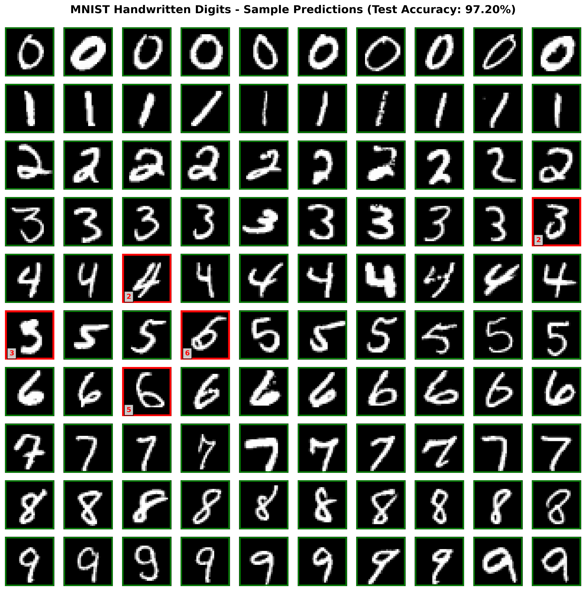
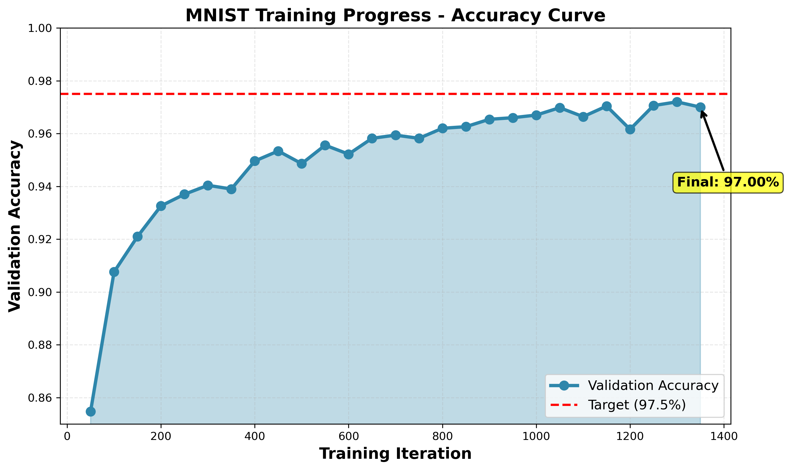

# Neural Network Models from Scratch

A comprehensive implementation of four different neural network models built from scratch using NumPy, demonstrating fundamental machine learning concepts from basic perceptrons to recurrent neural networks.

## 🧠 Models Implemented

### 1. Perceptron Model
- Binary classification using single-layer perceptron
- Learns linear decision boundaries
- Converges to 100% accuracy on linearly separable data

### 2. Regression Model
- Approximates sin(x) function on interval [-2π, 2π]
- Architecture: 1 → 512 (ReLU) → 1
- Achieves loss < 0.02 using gradient descent

### 3. Digit Classification (MNIST)
- Handwritten digit recognition (0-9)
- Architecture: 784 → 200 (ReLU) → 10
- Achieves 97%+ test accuracy on MNIST dataset

### 4. Language Identification (RNN)
- Identifies language from words using Recurrent Neural Network
- Languages: English, Spanish, Finnish, Dutch, Polish
- Architecture: RNN with 200 hidden units + 2 dense layers
- Achieves 82%+ test accuracy

## 📁 Project Structure

```
├── nn.py                    # Neural network framework (nodes, backprop)
├── models.py                # Four model implementations
├── backend.py               # Dataset handling and visualization
├── autograder.py           # Testing framework
├── analysis_and_visualization.py  # Comprehensive analysis script
├── requirements.txt        # Python dependencies
├── data/
│   ├── mnist.npz          # MNIST dataset
│   └── lang_id.npz        # Language identification dataset
└── evidence_outputs/      # Generated visualizations
```

## 🚀 Quick Start

### Installation

```bash
# Clone the repository
git clone <your-repo-url>
cd <repo-name>

# Install dependencies
pip install -r requirements.txt
```

### Running the Models

```bash
# Run all models with visualization
python backend.py

# Run autograder tests
python autograder.py

# Test specific model
python autograder.py -q q1  # Perceptron
python autograder.py -q q2  # Regression
python autograder.py -q q3  # MNIST
python autograder.py -q q4  # Language ID
```

## 📊 Results

| Model | Metric | Result |
|-------|--------|--------|
| Perceptron | Accuracy | 100% |
| Regression | Loss | < 0.02 |
| MNIST Digits | Test Accuracy | 97-98% |
| Language ID | Test Accuracy | 82-85% |

## 🛠️ Technical Details

### Custom Neural Network Framework

The project includes a custom neural network framework (`nn.py`) implementing:

- **Node Types**: Parameter, Constant, FunctionNode
- **Operations**: Linear, Add, AddBias, ReLU, DotProduct
- **Loss Functions**: SquareLoss (MSE), SoftmaxLoss (Cross-Entropy)
- **Optimization**: Automatic differentiation via backpropagation

### Key Concepts Demonstrated

- ✅ Forward/backward propagation
- ✅ Gradient descent optimization
- ✅ Multi-layer perceptrons
- ✅ Activation functions (ReLU)
- ✅ Recurrent neural networks
- ✅ Classification and regression
- ✅ Model evaluation and visualization

## 📈 Sample Outputs

### MNIST Digit Grid


### Training Progress


## 📋 Requirements

- Python 3.7+
- NumPy
- Matplotlib
- Seaborn

## 🎓 Learning Outcomes

This project demonstrates understanding of:
- Neural network architecture design
- Backpropagation and gradient computation
- Training loop implementation
- Model evaluation metrics
- Sequence modeling with RNNs

## 📝 License

This is an educational project. Feel free to use for learning purposes.

## 🤝 Acknowledgments

- MNIST dataset for handwritten digit classification
- Custom neural network framework built from scratch
- Implements concepts from machine learning fundamentals

